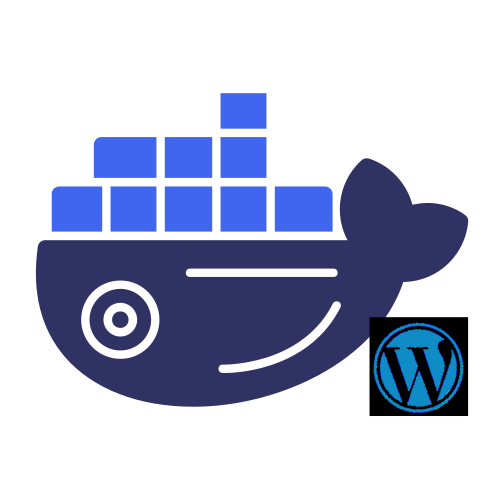

<div align="center">
  

# PHP-Nginx Docker Template

**Production-ready PHP-FPM + Nginx container stack for modern web applications**

[](https://github.com/nooblk-98/php-nginx-docker-template/actions/workflows/build-and-push.yml)
[](https://www.php.net/)
[](https://alpinelinux.org/)
[](https://nginx.org/)
[](https://www.docker.com/)
[](http://www.gnu.org/licenses/agpl-3.0)
[](https://github.com/nooblk-98/php-nginx-docker-template/commits/main)
[](https://github.com/nooblk-98/php-nginx-docker-template/blob/main/CONTRIBUTING.md)

[Features](#-features) • [Quick Start](#-quick-start) • [Documentation](#-documentation) • [Contributing](#-contributing)

</div>

---

## 📖 Overview

A battle-tested, production-grade Docker template combining **Nginx** and **PHP-FPM** on Alpine Linux. Engineered for security, performance, and developer productivity with zero-configuration deployment and enterprise-grade defaults.

### What's Included

- **Alpine Linux** - Minimal footprint (~50MB base image)
- **PHP-FPM** - Optimized with opcache, APCu, and performance tuning
- **Nginx** - Hardened configuration with security headers
- **Supervisor** - Process management with auto-restart
- **Tini** - Proper init system for graceful shutdowns
- **Health Checks** - Built-in endpoints for monitoring

---


## Features

### Security & Production Hardening

- **Non-root runtime** - Container runs as unprivileged `app` user, reducing attack surface
- **Locked-down defaults** - Nginx hides server details, security headers applied
- **Minimal Alpine base** - Smaller attack surface, fewer vulnerabilities to patch
- **Security headers** - X-Frame-Options, X-Content-Type-Options, X-XSS-Protection enabled

### Performance Optimization

- **Tuned opcache** - Pre-configured for speed with sensible caching defaults
- **Unix socket communication** - PHP-FPM and Nginx communicate via socket (faster than TCP)
- **Gzip compression** - Built-in compression for faster response times
- **Browser caching** - Optimized cache headers for static assets
- **Fast startup** - Lightweight Alpine base means quick container spin-up (<3s)

### Flexibility & Compatibility

- **Multiple PHP versions** - Pre-built images for PHP 7.4, 8.1, 8.2, 8.3, 8.4
- **Easy customization** - Override PHP settings via environment variables or `.env` file
- **Version-locked Alpine** - Each PHP version paired with compatible Alpine release
- **Common extensions included** - mysqli, pdo_mysql, gd, curl, zip, mbstring, opcache, and more

### Developer Experience

- **Zero configuration** - Just run `docker compose up` and start coding
- **Health endpoints** - Built-in `/fpm-ping` and `/fpm-status` for monitoring
- **Sample dashboard** - Included PHP info page to verify configuration
- **CI/CD ready** - GitHub Actions workflow included for automated builds
- **Hot reload** - Mount your code and see changes instantly

### Operational Reliability

- **Graceful shutdowns** - Tini init system handles signals properly
- **Supervised processes** - Supervisor manages nginx + php-fpm, auto-restarts on failure
- **Health checks** - Docker health checks ensure container is responding
- **Detailed logging** - Structured logs for debugging and monitoring
- **Clear documentation** - Comprehensive troubleshooting guide included

---

## 🚀 Quick Start

### Option 1: Docker Compose (Recommended)

```bash
# Clone the repository
git clone https://github.com/nooblk-98/php-nginx-docker-template.git
cd php-nginx-docker-template

# Start the container
docker compose up -d

# View logs
docker compose logs -f

# Visit your application
open http://localhost:8080
```

### Option 2: Docker Run

```bash
docker run -d \
  --name php-nginx \
  -p 8080:8080 \
  -v $(pwd)/src:/var/www/html \
  lahiru98s/php-nginx-docker-template:8.3
```

### Option 3: Pull from Registry

```bash
# Docker Hub
docker pull lahiru98s/php-nginx-docker-template:8.3

# GitHub Container Registry
docker pull ghcr.io/nooblk-98/php-nginx-docker-template:8.3
```

---

## 📦 Available PHP Versions

| PHP Version | Alpine Version | Image Tag | Status |
|-------------|----------------|-----------|--------|
| 8.4 | edge | `8.4`, `latest` | ✅ Stable |
| 8.3 | 3.20 | `8.3` | ✅ Stable |
| 8.2 | 3.20 | `8.2` | ✅ Stable |
| 8.1 | 3.18 | `8.1` | ✅ Stable |
| 7.4 | 3.15 | `7.4` | ⚠️ Legacy |

**Dockerfile locations:**
- PHP 7.4: [php74/Dockerfile](php74/Dockerfile)
- PHP 8.1: [php81/Dockerfile](php81/Dockerfile)
- PHP 8.2: [php82/Dockerfile](php82/Dockerfile)
- PHP 8.3: [php83/Dockerfile](php83/Dockerfile)
- PHP 8.4: [php84/Dockerfile](php84/Dockerfile)

---

## 🛠️ Building from Source

### Basic Build

```bash
# Default: PHP 8.3 on Alpine 3.20
docker build -t php-nginx:8.3 .
```

### Custom Build with Arguments

```bash
# Build PHP 8.2 on Alpine 3.19
docker build \
  -t php-nginx:8.2 \
  --build-arg PHP_VERSION=82 \
  --build-arg ALPINE_VERSION=3.19 \
  .
```

### Build Specific Version

```bash
# Build from version-specific Dockerfile
docker build -t php-nginx:8.4 -f php84/Dockerfile .
```

---

## ⚙️ Configuration

### Custom PHP Settings

The docker-compose.yml mounts `configs.php_overrides` into `/etc/php${PHP_VERSION}/conf.d/99-overrides.ini`.

```yaml
services:
  app:
    environment:
      - MEMORY_LIMIT=512M
      - MAX_EXECUTION_TIME=120
```

### Volume Mounts

```yaml
volumes:
  - ./src:/var/www/html              # Your application code
  - ./nginx/nginx.conf:/etc/nginx/nginx.conf           # Custom nginx config
  - ./php/php.ini:/etc/php83/php.ini                   # Custom PHP config
```

---

## 📊 Monitoring & Health Checks

### Health Endpoints (localhost only)

- **FPM Ping:** `http://localhost:8080/fpm-ping` - Returns `pong` if PHP-FPM is healthy
- **FPM Status:** `http://localhost:8080/fpm-status` - Detailed PHP-FPM pool statistics

### Docker Health Check

```bash
# Check container health
docker inspect --format='{{.State.Health.Status}}' php-nginx

# View health check logs
docker inspect --format='{{json .State.Health}}' php-nginx | jq
```

### Logs

```bash
# View all logs
docker compose logs -f

# View specific service
docker logs php-nginx

# Nginx access logs
docker exec php-nginx tail -f /var/log/nginx/access.log

# PHP-FPM logs
docker exec php-nginx tail -f /var/log/php-fpm/error.log
```

---


## 🔧 Common Troubleshooting

### `apk add php81-* not found`

**Solution:** Use the Alpine release that ships that PHP minor version.
- PHP 8.1 → Alpine 3.18
- PHP 8.2 → Alpine 3.20
- PHP 8.3 → Alpine 3.20
- PHP 8.4 → Alpine edge

```bash
docker build --build-arg PHP_VERSION=81 --build-arg ALPINE_VERSION=3.18 .
```

### `permission denied` on sockets/logs

**Solution:** Ensure mounts are writable by the `app` user (UID 1000).

```bash
# On host
chown -R 1000:1000 ./src

# Or in docker-compose.yml
services:
  app:
    user: "1000:1000"
```

### Slow builds on CI

**Solution:** Enable buildx cache in GitHub Actions.

```yaml
- name: Build and push
  uses: docker/build-push-action@v5
  with:
    cache-from: type=gha
    cache-to: type=gha,mode=max
```

### Healthcheck failing

**Solution:** Verify PHP-FPM socket and nginx configuration.

```bash
# Check if socket exists
docker exec php-nginx ls -la /run/php/php-fpm.sock

# Test ping endpoint
docker exec php-nginx curl -f http://localhost:8080/fpm-ping

# Check nginx config
docker exec php-nginx nginx -t
```

### Application shows white page

**Solution:** Check PHP error logs and permissions.

```bash
# Enable error display temporarily
docker exec php-nginx sed -i 's/display_errors = Off/display_errors = On/' /etc/php83/php.ini
docker exec php-nginx supervisorctl restart php-fpm

# Check logs
docker exec php-nginx tail -f /var/log/php-fpm/error.log
```

---

## 📚 Documentation

### Key Configuration Files

- **[nginx.conf](nginx/nginx.conf)** - Nginx global settings
- **[default.conf](nginx/conf.d/default.conf)** - Server block configuration
- **[php.ini](php/php.ini)** - PHP runtime settings
- **[fpm-pool.conf](php/fpm-pool.conf)** - PHP-FPM pool configuration
- **[supervisord.conf](supervisord/supervisord.conf)** - Process supervision


## 🤝 Contributing

We welcome contributions! Please follow these steps:

1. **Fork the repository**
   ```bash
   gh repo fork nooblk-98/php-nginx-docker-template
   ```

2. **Create a feature branch**
   ```bash
   git checkout -b feature/amazing-feature
   ```

3. **Make your changes**
   - Follow existing code style
   - Update documentation if needed
   - Test your changes thoroughly

4. **Commit your changes**
   ```bash
   git commit -m "feat: add amazing feature"
   ```

5. **Push to your fork**
   ```bash
   git push origin feature/amazing-feature
   ```

6. **Open a Pull Request**
   - Describe your changes clearly
   - Reference any related issues

### Development Guidelines

- Test with multiple PHP versions
- Ensure security best practices
- Update README for new features
- Add comments for complex configurations
- Run shellcheck on scripts

---

## 📝 License

This project is licensed under the **GNU Affero General Public License v3.0** (AGPL-3.0).
See [LICENSE](LICENSE) for full details.

---

## 🙏 Acknowledgments

- Built with [Alpine Linux](https://alpinelinux.org/)
- Powered by [Nginx](https://nginx.org/) and [PHP-FPM](https://www.php.net/manual/en/install.fpm.php)
- Process management by [Supervisor](http://supervisord.org/)
- Init system by [Tini](https://github.com/krallin/tini)

---

<div align="center">

**Made with ❤️ by NoobLK**

[⬆ Back to top](#php-nginx-docker-template)

</div>
